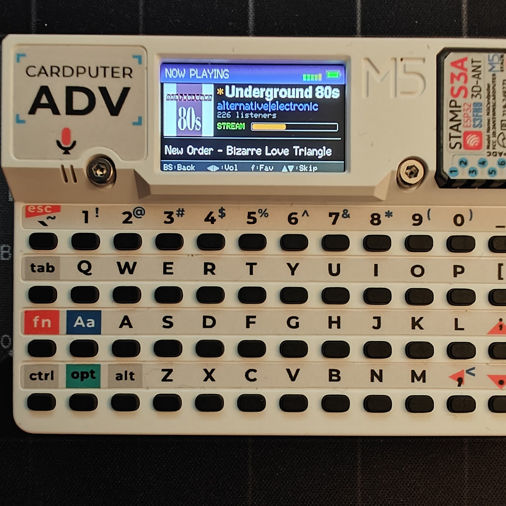

# SOMA FM Radio Player

Internet radio player for the **M5Stack Cardputer** that streams all [SOMA FM](https://somafm.com) channels.




## Features

- On-device WiFi setup — scan, select, and enter password right on the Cardputer
- WiFi credentials remembered in flash (no hardcoded config needed)
- Browse all SOMA FM stations with genre-colored list
- MP3 streaming via direct I2S output (gapless, no choppy audio)
- Station logos fetched and scaled from SOMA FM
- Now-playing track info with auto-refresh
- Car-radio style auto-scrolling text for long titles and song names
- Favorite stations with persistent storage (pinned to top of list)
- Pause / resume with space bar
- LittleFS caching of channel list and station logos for fast startup
- Remembers last selected station across reboots
- Battery level gauge in the header bar
- Audio visualizers: EQ bars, waveform, VU meter (Tab to cycle)
- Volume control with on-screen bar (remembered across reboots)
- Auto-repeat scrolling in station browser (hold up/down)
- Screen dims after 15s idle when playing with visualizer off
- Quick station switching without stopping playback

## Hardware

Works on both Cardputer models (same I2S pins, same form factor):

- **M5Stack Cardputer** (ESP32-S3, NS4168 amplifier)
- **M5Stack Cardputer ADV** (ESP32-S3, ES8311 codec)

No PSRAM required.

## Controls

### Station Browser
| Key | Action |
|-----|--------|
| `w` / `;` | Scroll up (hold to repeat) |
| `s` / `.` | Scroll down (hold to repeat) |
| `q` | Page up |
| `e` | Page down |
| `,` / `/` | Volume down / up |
| `f` | Toggle favorite |
| `n` | WiFi setup (change network) |
| `Space` | Pause / resume (or play selected) |
| `Tab` | Cycle visualizer (off / bars / wave / VU) |
| `Enter` | Play station |

### Now Playing
| Key | Action |
|-----|--------|
| `G0` / `BS` | Back to browser |
| `x` | Stop playback & back |
| `;` / `.` | Previous / next station |
| `,` / `/` | Volume down / up |
| `f` | Toggle favorite |
| `Space` | Pause / resume |
| `Tab` | Cycle visualizer |

## Setup

1. Build and upload with PlatformIO:
   ```
   pio run -e cardputer -t upload
   ```

2. On first boot, the WiFi scan screen appears automatically. Select your network and enter the password — credentials are saved to flash and remembered across reboots. Press `n` in the browser to change networks later.

## Dependencies

Managed automatically by PlatformIO:

- M5Cardputer
- M5Unified
- M5GFX
- ESP8266Audio
- ArduinoJson

## Architecture

- **Core 0**: Audio decoder task (MP3 decode + I2S DMA writes)
- **Core 1**: UI rendering + input handling + network fetches
- Direct I2S output on port 1 bypasses M5.Speaker for gapless audio
- On Cardputer ADV, ES8311 codec is initialized via I2C; on the original Cardputer, the NS4168 amplifier needs no configuration
- WiFi credentials, favorites, and last station stored in NVS flash via the Preferences library
- On-device WiFi scan and password entry — no hardcoded credentials needed
- Channel list and logos cached to LittleFS for instant startup on subsequent boots
